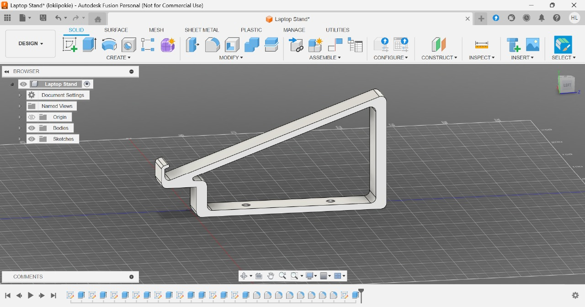
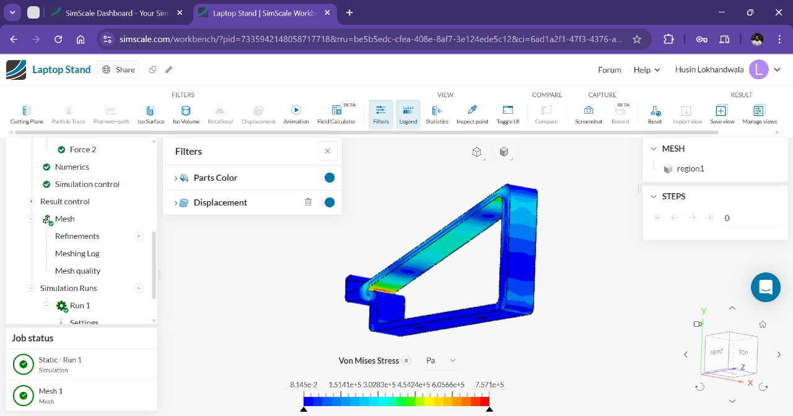

# Design and FEA of a 3D-Printable Laptop Stand

## Overview

This project showcases a complete engineering design and validation workflow for a functional, lightweight laptop stand. The model was designed from scratch in **Autodesk Fusion 360** with the goal of being easily manufactured via FDM 3D printing.

To ensure its structural integrity, a **static structural analysis** was performed using **SimScale**, a cloud-based FEA platform. The simulation tested the stand's ability to handle the load of a standard laptop, allowing for the validation of the design before any physical prototyping.

---

## Version 1 

## 🛠️ Tools Used

* **CAD Software:** Autodesk Fusion 360
* **FEA Software:** SimScale

---

## 💡 Key Skills Demonstrated

### CAD Modeling
* **3D Parametric Design:** Creating and modifying robust geometries in Autodesk Fusion 360.
* **Sketching & Constraints:** Building fully defined 2D sketches as a foundation for 3D features.
* **Solid Modeling:** Using features like Extrude, Fillet, and Chamfer to create functional parts.

### Finite Element Analysis (FEA)
* **Pre-Processing:** Setting up simulations by defining materials, applying boundary conditions (fixed supports), and simulating real-world loads.
* **Meshing:** Generating a high-quality computational mesh for accurate results.
* **Post-Processing:** Interpreting simulation outputs like **Von Mises stress** and **displacement** plots to make informed engineering decisions.
* **Stress Analysis:** Identifying and mitigating areas of high stress concentration.

---

## 📊 Analysis & Results

The simulation results confirmed that the design is robust enough to safely support a typical laptop load.

* **Maximum Von Mises Stress:** The analysis identified a maximum stress of **7.57 x 10⁵ Pa**. This is well below the yield strength of common 3D printing materials like PLA or ABS, indicating the design will not fail under the specified load.
* **Key Insight:** The highest stress concentration was observed at the sharp internal corner where the angled support meets the base.

---

## 🚀 Future Work

While the current design is validated, the following improvements could be made:

1.  **Design Optimization:** Make a modular mode the ability to add ascessories like fans for cooling phone holder etc.
